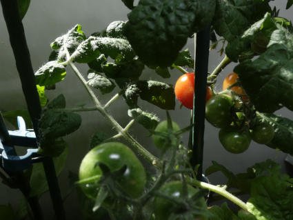

-----
Notes
-----

++++++++++++++++++++++++++++++++++++++++++++++
Ajout de nutriments et remplacement du liquide
++++++++++++++++++++++++++++++++++++++++++++++

Quand doit-on ajouter de la solutions nutritive fraîche ? Pas clair. On se fie à la lecture EC pour la concentration générale... Ça ne varie pas beaucoup (contrairement au Ph qui augmente de ~0.1 par jour).

.. todo::
    Vérifier le Ph de la soupe aux 3 jours ; dans les conditions actuelles ajouter 1 ml de **Ph-** aux 4 jours.

On remplace l'eau : quelques litres "neufs" par semaine + ajustements Ph ad hoc [#f1]_.

.. todo::
    Remplacer 10-15 litres eau aux 2-3 semaines et ajuster nutriments et Ph.

++++++++++++++++++++
Horaire d'irrigation
++++++++++++++++++++

Encore en train de déterminer la bonne fréquence. Les sources sont assez divergentes, certains arrosent 24h sur 24, d'autres racontent que la norme est d'un quart d'heure par heure pendant la période d'éclairage. Bref, pas clair, en plus des ajustements pour phase de croissance.

Pour le moment ça a été 3 X 15 min. par jour. Ça ne semble pas assez, croissance lente... (mais pas de morts è signaler).

++++++++++++++++++++++++++++++
Types de diffuseurs (drippers)
++++++++++++++++++++++++++++++
On a le modèle en forme de piquet pour un pot carré de 13 cm de côté, ça n'a pas l'air de mouiller toutes les billes d'argile. Ça prendrait peut-être un diffuseur plus large, qui couvre plus de surface.

++++++++++++++++++++++++++++++
Fin de la culture (saison 1)
++++++++++++++++++++++++++++++
La terre, la vraie, celle qu'il faut mouvoir, nourrir et ensemencer, appelant les seules ressources disponibles, on a simplement arrêté la culture hydroponique et nettoyé l'équipement.

Conclusion : des piments variés (peut-être un demi kilo), un peu de petites tomates (pas éclatant comme résultat) un peu de kale et de
la laitue. Pour ce premier test on a fait quelques erreurs dont (pour le test) faire pousser des plantes qui n'ont pas les mêmes besoins nutritifs. Les piment sont partis à l'assaut de l'éclairage et ont vite monopolisé la lumière, sauf des percées artificielles de notre part.

Quelques remarques finales: vu le compromis entre tomates et piments, on a maintenu le ph entre 5.8 et 6.3. L'E.C. a été maintenue entre 1.8 et 3 (vers la fin). La quantité de nutrimens semblait exponentielle pour affecter la lecture d'un dixième de milli-siemens/cm...

On recommence cet hiver avec des plantes à feuilles seulement.

Résultats
#########

.. sidebar::

    .. figure:: ./images/saison1_piment.jpg
      :width: 250
      :alt: Piments en juin 2023

    Piments en juin 2023

Petites tomates en juin 2023

Conclusion pour la première saison
##################################

À part d'avoir mis un peu n'importe quoi dans les pots, il y a eu des résultats intéressants. Comment déjà mentionné, les piments on gagné, en termes d'occupation d'espace et d'accaparement de la lumière. Laitues et persil : pas fameux, trop bas, paramètres hors normes.

Derniers changements : |today|

.. [#f1] Exemple de résultat pour un changement de liquide: 20 l de solution remplacés par eau du robinet: le EC est passé de 1.35 à 0.6 et le Ph a un peu augmenté 6.2 à 6.5 ; pour équilibrer la soupe on a ajouté 30 ml de A et 30 ml de B (2 fois moins que selon les instructions du fabricant), puis ~2.5 ml de Ph-. Résultat final : EC à 1.24 et Ph à 5.6.
