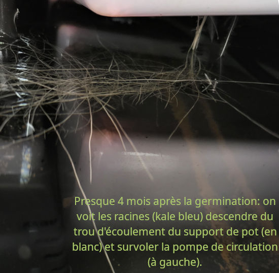

========
Saison 3
========

On reprend (tôt):

Après avoir défriché la forêt de basilic de la saison 2, on a fait germer du kale et de la laitue. D'ailleurs, on a réussi à transplanter le basilic hydroponique en terre, disons survie de 66 % des plants (arbustes !). Ils n'ont pas trop aimé, quand même.

Mélange de graines ou distraction, je ne suis plus certain du type de laitue. Idem pour le kale bleu, l'espèce précise sera à déterminer une fois mature. Je biberonne encore les pousses de laitue et basilic puisque le diffuseur ne rejoint pas encore leurs jeunes racines.

Ça pousse vite, notre intention était de préparer l'automne et l'hiver ; j'ai l'impression que rendus à l'hiver on aura une autre jungle, voire une autre saison en marche...

Question paramètres, je maintiens un Ph près de 6.7 et un E.C. de 1.6, les données trouvées (en annexe) sont un peu larges...

.. figure:: ./images/saison_3a.JPG

**************
Démarrage
**************

.. sidebar::

    .. figure:: ./images/saison_3b.JPG
      :width: 450
      :alt: jeune kale "russe" et "bleu"

      Jeune kale "russe" et "bleu" (19 août 2024)

.. figure:: ./images/saison_3c.JPG
  :width: 200
  :alt: pousses de laitue et basilic

  Pousses de laitue et basilic (19 août 2024)

**Curiosité**

.. figure:: ./images/kale_sur_kale.png
      :width: 350
      :alt: Des pousses directement sur un feuille ??

      Des pousses directement sur un feuille ?? (22 août 2024)

Je ne suis pas certain de comprendre pourquoi il y a cette croissance quasi-anarchique de pousses sur les feuilles de kale...

***********
On en mange
***********

Il faut bien le dire, ça pousse comme de la mauvaise herbe, il a fallu que je prenne activement la défense du kale bleu qui n'était pas à la hauteur (!) de la compétiion vers la lumière. Miam quand même, variété douce au goût. Les pots partagés avec de la laitue on fait chou blanc, en fait la laitue seulement. Le basilic s'en sort et croît glorieusement.

**Ce qu'on ne voit pas**

.. sidebar::

    .. figure:: ./images/kale_bleu.jpg
      :width: 400
      :alt: kale "russe" et "bleu"

      À droite: kale "bleu" (28 sept. 2024)

      Vue directement dans le bassin, sous les pots : elles ont fait leur chemin, les racines... (28 sept. 2024)

On mange un peu de kale presque chaque jour ; je coupe les feuilles (énormes) trop collées sur les barres de lumière tout en donnant une chance à celles peinant dans l'ombre des grandes feuilles.

Décidément, dans quelques jours ou semaines ça va être la rebelote de semis pour la saison hivernale ; moins de kale, un peu d'herbe pour les chats, pas de la cataire mais de l'avoine, blé ou orge. Ils adorent et les matins d'hiver, ils en exigent ! C'est que à force de couper des feuilles de kale on va avoir des troncs de plus en plus gros et les tiges trop hautes... Pour le moment les plants sont heureux alors on verra plus tard pour la saison 4.

Derniers changements : |today|
