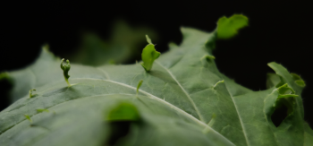

========
Saison 3
========

On reprend (tôt):

Après avoir défriché la forêt de basilic de la saison 2, on a fait germer du kale et de la laitue. D'ailleurs, on a réussi à transplanter le basilic hydroponique en terre, disons survie de 66 % des plants (arbustes !). Ils n'ont pas trop aimé, quand même.

Mélange de graines ou distraction, je ne suis plus certain du type de laitue. Idem pour le kale bleu, l'espèce précise sera à déterminer une fois mature. Je biberonne encore les pousses de laitue et basilic puisque le diffuseur ne rejoint pas encore leurs jeunes racines.

Ça pousse vite, notre intention était de préparer l'automne et l'hiver ; j'ai l'impression que rendus à l'hiver on aura une autre jungle, voire une autre saison en marche...

Question paramètres, je maintiens un Ph près de 6.7 et un E.C. de 1.6, les données trouvées (en annexe) sont un peu larges...

.. figure:: ./images/saison_3a.JPG

**************
Démarrage
**************

.. sidebar::

    .. figure:: ./images/saison_3b.JPG
      :width: 450
      :alt: jeune kale "russe" et "bleu"

      Jeune kale "russe" et "bleu" (19 août 2024)

  Pousses de laitue et basilic (19 août 2024)

**Curiosité**

      Des pousses directement sur un feuille ?? (22 août 2024)

Je ne suis pas certain de comprendre pourquoi il y a cette croissance quasi anarchique de pousse sur les feuilles de kale...

Derniers changements : |today|
