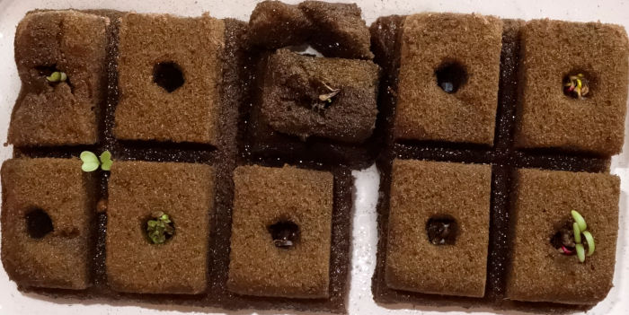

========
Saison 4
========

On reprend en cette fin 2024:

Ça commence par un nettoyage des composantes. Réservoir, pompe, billes d'argile, tout.

On va manger du kale au réveillon du Jour de l'an, les troncs vraiment gros et les racines longues me donnaient à penser que les plants étaient sur leur fin, surtout en fait que les feuilles avaient moins fière allure, plus propices à la décoloration et une espèce de dépôt blanc...

**************
Démarrage
**************

Après quelques hésitations sur les prochaines pousses, voici dnc les semis candidats.

  Candidats saison 4

.. sidebar::

    .. uml::

        @startuml
        title Plan saison 4
        start
        split
            :1;
            :6;
        split again
            :2;
            :7;
            split again
            :3;
            :8;
            split again
            :4;
            :9;
            split again
            :5;
            :10;
        @enduml

- **1, 2, 6**: Kale Lacinato brassica oleracea acephala lacinata
- **3**: Persil italien
- **4**: Basilic
- **5, 10**: Bette à carde beta vulgaris cycla
- **7**: Laitue lactua sativa
- **8**: Aneth
- **9**: Coriandre coriandum sativa

-----------------------------------

    Avant de planter les égoutteurs je biberonne les plants (avant-plan: bettes-à-carde).

-----------------------------------

    Presque à la fin de l'arrosage manuel. Les égoutteurs alimentent quelques racines. (G. à d.) Kale, laitue, persil, aneth, basilic (pas prêt), coriandre, bette-à-carde(s)

_____________________________________

    Finalement, le 5 mars, arangement autonome, sauf basilic (semé plus tard) qui requiert des arrosages manuels. Les kales sont à 50 cm.

Le Ph est maintenu à 5.5 max, ça réussit mieux par rapport aux autres saisons.

_____________________________________

Derniers changements : |today|
