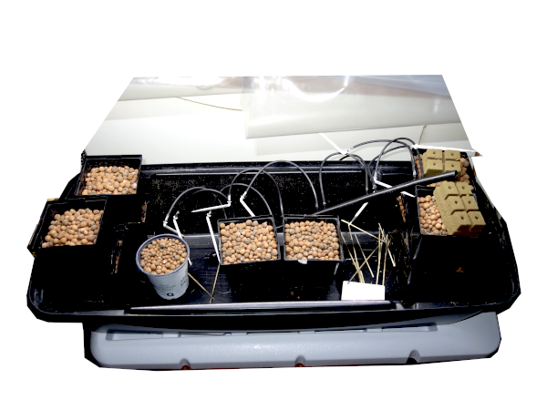
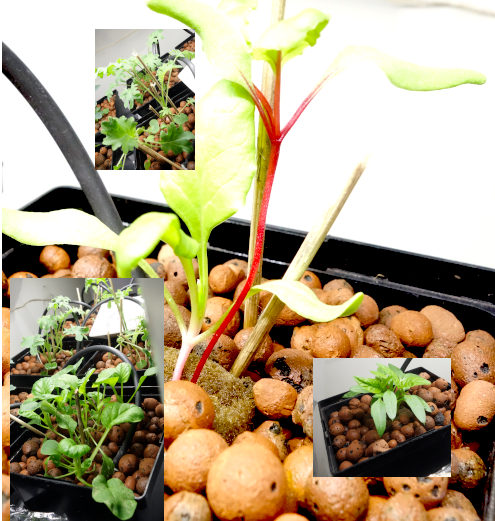
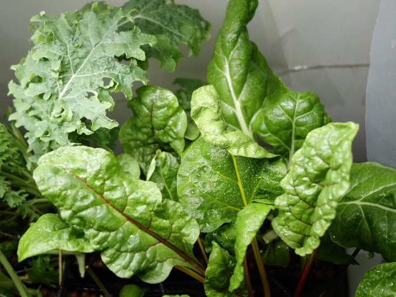

========
Saison 5
========

Automne 2025: j'aimerais avoir des feuilles fraîches à Noël. Donc, je sèmerai dès le début octobre.

**************
Démarrage
**************

Espèces à décider, probablement bette-à-carde et basilic.

  C'est à réinstaller...

.. sidebar::

    .. uml::

        @startuml
        title Plan saison 5
        start
        split
            :1;
            :6;
        split again
            :2;
            :7;
            split again
            :3;
            :8;
            split again
            :4;
            :9;
            split again
            :5;
            :10;
        @enduml

.. comentaire figure:: ./images/semis_2025.jpg
  :width: 250
  :alt: soyons patients

.. comentaire- **1, 2, 6**: Kale Lacinato brassica oleracea acephala lacinata
    - **3**: Persil italien
    - **4**: Basilic
    - **5, 10**: Bette à carde beta vulgaris cycla
    - **7**: Laitue lactua sativa
    - **8**: Aneth
    - **9**: Coriandre coriandum sativa

-----------------------------------

.. comentaire figure:: ./images/15_janv_bette.png
    :width: 450
    :alt: Pouponnière.
    Avant de planter les égoutteurs je biberonne les plants (avant-plan: bettes-à-carde).

.. comentaire figure:: ./images/trio_7_fev_25.png
    :width: 800
    :alt: Post_biberon
    Presque à la fin de l'arrosage manuel. Les égoutteurs alimentent quelques racines. (G. à d.) Kale, laitue, persil, aneth, basilic (pas prêt), coriandre, bette-à-carde(s)

_____________________________________

On sème...

- **1** Piment d'Espelette

- **2-3** Kale Lacinato (le 2 a souffert, remplacé par persil)

- **4** Tsatsoï

- **5-6** Kale frisé

- **7-8** Bette-à-carde rouge (8 a souffert remplacé par basilic)

- **9-10** Bette-à-carde "Bright light"

    Bette-à-carde au fond; premier plan : Tsatsoï, Kale, Espelette

Confession: j'ai oublié de traiter l'eau de mon bassin et elle est devenue pas mal alcaline, il était temps que je vérifie; aussi je n'avais pas encore ajouté mes solutions nutrifives. Ah làlà, distractions... Ça n'explique pas vraiment pourquoi 2 blocs *oasis* refusent au semis de croître...

*****************
Plus deux mois...
*****************

Saison un peu lente, il me semble.

Quand même, deux mois après (j'écris le 15 décembre) il y a quelques résultats. En gros, l'espelette est heureux mais au stade floral seulement, ci-après.

.. sidebar::

    .. figure:: ./images/fleur_espelette.jpg
        :width: 300
        :alt: 15 décembre, deux mois espelette !

        Fleur d'espelette

.. figure:: ./images/plant_espelette.jpg
    :width: 250
    :alt: petit plant d'espelette de 40 cm

    Plant d'espelette

-------------------------------------------------------------

Il faut dire qu'on coupe des feuilles de tsatsoï, kale et bette-à-carde depuis quelques semaines. Le kale bleu est assez triste et le persil n'a jamais marché.  Je me suis concentré sur une solution plutôt acide ( Ph 5.5 - 6.0, e.c. autour de 2.0) . Bref, il y a quand même quelques gagnants...

    .. figure:: ./images/tsatsoi_15dec.jpg
        :width: 200
        :alt: Tsatsoï

        Tsatsoï, un peu petit.

.. sidebar::

    .. figure:: ./images/plusieurs_fleurs.jpg
        :width: 300
        :alt: quelques fleurs

        Il y a quelques fleurs...

    Bette-à-carde et kale, ils sont plutôt heureux...

------------------------------------------------

Derniers changements : |today|
