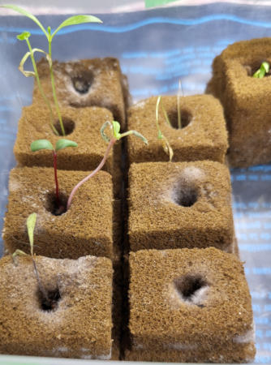
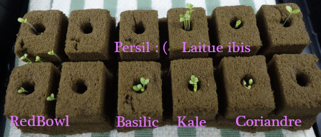
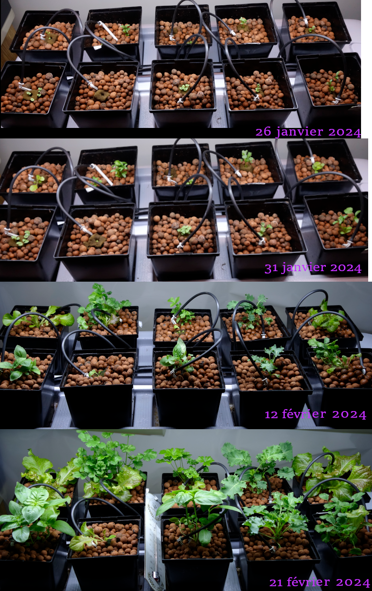

Saison 2
========

Préparatifs:

L'été est donc passé et y commence à faire frette, donc on repart la culture intérieure.

L'éclairage sera un peu plus fort avec 3 petites barres LED additionnelles et un support qui permet plus de souplesse dans les distances.

Des *forces occultes* ont déjà décidé des types de plantes à cultiver, quoiqu'il soit convenu qu'on ferait pousser des "feuilles" (pas de fruits ni de fleurs).

On aurait donc: laitue, persil, basilic, coriandre, kale, bette à carde, et chicorée.

Mes recherches démontrent qu'il y a un écart dans les valeurs de EC et Ph et que ça risque de nuire à une production *optimale* (v. image ci-après)

.. figure:: ./images/limites_5_plantes.png

    On peut voir les écarts et la moyenne qu'il faudra faire en termes de valeurs de EC et Ph. On avisera une fois dans les feuilles...

Par ailleurs, j'ai trouvé des valeurs de EC et Ph, glanées ici et là sur le web (fabricants, vendeurs, expérimentateurs, scientifiques...) et cette table :doc:`semis` indique pour plusieurs plantes les valeurs spécifiques.

Semis saison 2
++++++++++++++

.. sidebar::

    .. figure:: ./images/semis2.jpg
      :width: 200
      :alt: semis de laitue "red bowl"

      Semis de laitue "red bowl" (3 décembre 2023)

.. figure:: ./images/semis1.jpg
  :width: 200
  :alt: semis coriandre

  Semis de coriandre (3 décembre 2023)

**Soucis** : Pour une raison pas claire, les semis semblent bloqués à une certaine hauteur et on ne voit pas trop de développement racinaire, malgré un éclairage plus vers le bleu. Il y a même un développement de moisi ou je ne sais quel champignon en cours. Nos cubes sont de type *Oasis* et on utilise aussi un fond chauffant. Alors ? Trop chaud et trop humide ? À voir ...

  Semis et moisissure (15 décembre 2023)

**On reprend.** Bon, les fêtes, etc. pas trop de disponibilité, bref je recommence le projet avec une référence qui vient d'un site qui utilise les cubes Oasis et qui fait des recommandations intéressantes (`https://www.emeshfarms.com/grow-seedling-using-oasis-cube/ <https://www.emeshfarms.com/grow-seedling-using-oasis-cube/>`_ pour ne pas le nommer). Donc, 10 jours après. mes nouveaux semis ressemblent à ceci:

  Semis 2e essai (18 janvier 2024)

**Ça pousse, pas trop vite....**  Après ce nouveau départ, on a finalement placé les semis dans les boules d'argile. Vu le gene de gicleur (dripper), j'ai continué à donner le biberon aux petites pousses. Aussi elles ont été mélangées et le plan n'est plus le même. Il y a quelques paires douteuses, coriandre et laitue...

  Jeunots en place dans les pots (26 janvier au 21 février 2024)

Derniers changements : |today|
