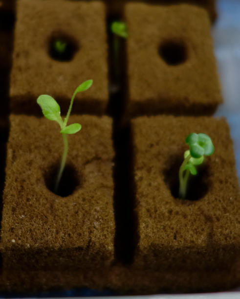

Saison 2
========

Préparatifs:

L'été est donc passé et y commence à faire frette, donc on repart la culture intérieure.

L'éclairage sera un peu plus fort avec 3 petites barres LED additionnelles et un support qui permet plus de souplesse dans les distances.

Des *forces occultes* ont déjà décidé des types de plantes à cultiver, quoiqu'il soit convenu qu'on ferait pousser des "feuilles" (pas de fruits ni de fleurs).

On aurait donc: laitue, persil, basilic, coriandre, kale, bette à carde, et chicorée.

Mes recherches démontrent qu'il y a un écart dans les valeurs de EC et Ph et que ça risque de nuire à une production *optimale* (v. image ci-après)

.. figure:: ./images/limites_5_plantes.png

    On peut voir les écarts et la moyenne qu'il faudra faire en termes de valeurs de EC et Ph. On avisera une fois dans les feuilles...

Par ailleurs, j'ai trouvé des valeurs de EC et Ph, glanées ici et là sur le web (fabricants, vendeurs, expérimentateurs, scientifiques...) et cette table :doc:`semis` indique pour plusieurs plantes les valeurs spécifiques.

Semis saison 2
++++++++++++++

.. sidebar::

    .. figure:: ./images/semis2.jpg
      :width: 200
      :alt: semis de laitue "red bowl"

      Semis de laitue "red bowl" (3 décembre 2023)

  Semis de coriandre (3 décembre 2023)

|
|
|
|
|
|
En gros c'est le :doc:`recolte_s2`

|
|
|

Derniers changements : |today|
