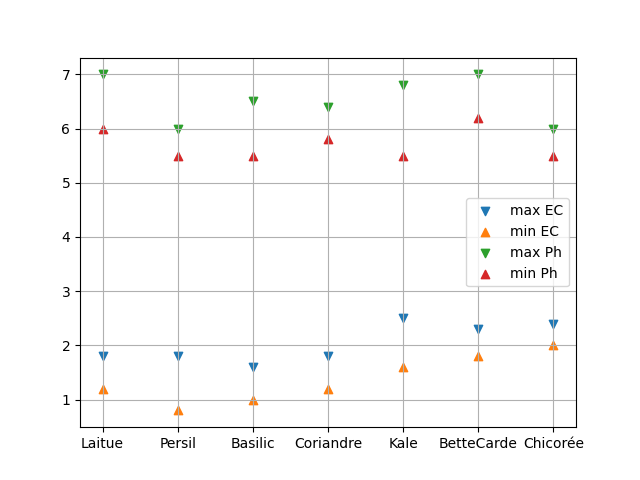

Saison 2
========

Préparatifs:

L'été est donc passé et y commence à faire frette, donc on repart la culture intérieure.

L'éclairage sera un peu plus fort avec 3 petites barres LED additionnelles et un support qui permet plus de souplesse dans les distances.

Des *forces occultes* ont déjà décidé des types de plantes à cultiver, quoiqu'il soit convenu qu'on ferait pousser des "feuilles" (pas de fruits ni de fleurs).

On aurait donc: laitue, persil, basilic, coriandre, kale, bette à carde, et chicorée.

Ça aurait été intéressant de comparer les exigences typiques des plantes (voir table (lien externe): `table_1 <_static/externe/plantes/table_JK3.html>`_)

.. todo::
    table des valeurs ec et ph à traduire.

Mes recherches démontrent qu'il y a un écart dans les valeurs de EC et Ph et que ça risque de nuire à une production *optimale* (v. image ci-après)

On peut voir les écarts et la moyenne qu'il faudra faire en termes de valeurs de EC et Ph. On verra.

Le plan provisoire pour les semis :doc:`recolte_s2`

Derniers changements : |today|